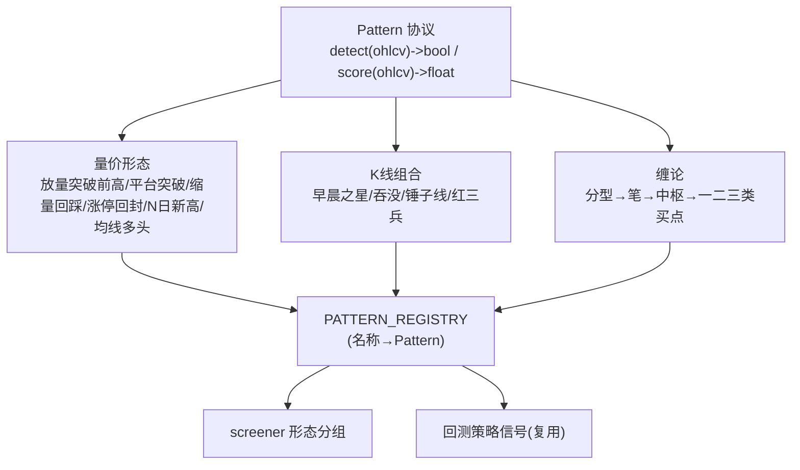
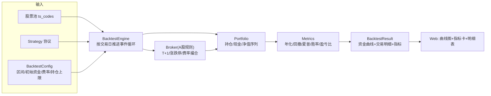

# 优化路线图：因子选股增强 + 回测引擎建设

> 生成时间：2026-06-17 14:05　|　配套《项目架构全景文档_20260617_140534.md》
> 本文给出两大短板的**落地方案**：① 因子选股升级为「形态/量价/缠论」可插拔引擎；
> ② 从零建一个「任意股 × 任意策略 × 资金曲线」的可扩展回测引擎。
> 每节按 **现状 → 目标 → 怎么做（含代码骨架）→ 为什么 → 验收** 组织。

> 贯穿原则（遵循 `CLAUDE.md`）：**SOLID / 依赖注入 / 协议抽象 / 高可测试 / 可扩展**。
> 所有数据访问走 `CompositeProvider`，新模块用「纯函数 + 协议 + DI」，每个核心逻辑配单测。

---

## 第〇部分：共同地基 —— 前复权个股序列数据层（两件事都依赖，必须先做）

### 现状
- 全市场日线是 **不复权**（`Tushare daily`），仅均线广度用前复权。
- `history_loader.load_price_matrix` 按「日 × 全市场」pivot，**适合横截面、不适合单股长历史**：
  回测一只票 3 年要把全市场 700+ 天日线都拉来 pivot，浪费且慢。

### 目标
新增一个**按 ts_code 取长周期前复权 OHLCV** 的能力：
```
get_stock_kline("600519.SH", "20230101", "20260617", adj="qfq") -> DataFrame[date, open, high, low, close, vol, amount]
```

### 怎么做
1. `DataProvider` 抽象 + `TushareProvider` 新增 `get_stock_daily(ts_code, start, end)`（Tushare `daily` 支持按 ts_code+区间一次拉全）。
2. 复权：用已有 `get_adj_factor`，**前复权 = 价格 × (adj_factor / 最新 adj_factor)**。封装独立纯函数便于单测。
3. 缓存：`data_cache/kline/{ts_code}_{adj}.parquet`，增量更新（只补最新缺的交易日）。

```python
# app/data/kline_loader.py  （新增）
"""单股长周期前复权 K 线加载（回测/形态识别共用）。"""
from __future__ import annotations
import pandas as pd
from app.data.provider import DataProvider

def load_kline(ts_code: str, start: str, end: str,
               provider: DataProvider, adj: str = "qfq") -> pd.DataFrame:
    """
    返回单股 [trade_date, open, high, low, close, vol, amount]（按日升序）。
    adj: 'qfq' 前复权 / 'none' 不复权。前复权用于形态识别与个股回测。
    """
    raw = provider.get_stock_daily(ts_code, start, end)          # Tushare daily 区间
    if raw is None or raw.empty:
        return pd.DataFrame()
    raw = raw.sort_values("trade_date").reset_index(drop=True)
    if adj == "qfq":
        factor = provider.get_adj_factor_series(ts_code, start, end)  # {date: adj_factor}
        raw = _apply_qfq(raw, factor)
    return raw

def _apply_qfq(df: pd.DataFrame, factor: pd.Series) -> pd.DataFrame:
    """前复权：OHLC × (当日因子 / 最新因子)。纯函数，便于单测。"""
    f = df["trade_date"].map(factor)
    ratio = f / f.iloc[-1]
    out = df.copy()
    for col in ("open", "high", "low", "close"):
        out[col] = (df[col] * ratio).round(3)
    return out
```

### 为什么
- 形态识别（突破前高、缠论分型）和个股回测**都需要连续、无除权跳空的单股序列**，否则除权日会被误判为「大跌/大涨」。
- 按 ts_code 拉取 + 单股缓存，回测一只票从「拉全市场 700 天」降到「拉 1 股 700 天」。

### 验收
- `load_kline("600519.SH",...,adj="qfq")` 在已知除权日（如分红送转）**无异常跳空**；
- 单测：构造含除权的合成数据，断言前复权后价格连续。

---

## 第一部分：因子选股升级 —— 可插拔「形态/量价/缠论」引擎

### 现状
`screener.py` 是**静态因子布尔筛选**（市值/换手/RPS/MACD金叉/RSI…），表达力止于「单点阈值」，
做不了「**放量突破20日新高**」「**缩量回踩MA20企稳**」「**缠论一买**」这类**形态/序列**条件。

### 目标
引入**可插拔 Pattern（形态）协议**：每个形态是一个独立、可单测、可回测复用的对象，
新增形态**零侵入**（注册即用）。前端因子选股新增「形态」分组，勾选即筛。

### 架构设计（SOLID·策略模式）



```python
# app/factors/patterns/base.py  （新增）
"""形态识别协议：输入单股前复权 OHLCV，输出是否命中 / 强度评分。"""
from __future__ import annotations
from typing import Protocol
import pandas as pd

class Pattern(Protocol):
    key: str            # 唯一标识，如 "breakout_high_20"
    label: str          # 显示名，如 "放量突破20日新高"
    min_bars: int       # 所需最少K线数

    def detect(self, ohlcv: pd.DataFrame) -> bool:
        """最后一根K线是否命中该形态。ohlcv 按日升序，含 open/high/low/close/vol。"""
        ...

    def score(self, ohlcv: pd.DataFrame) -> float:
        """命中强度 0~100（用于排序，可选；默认命中=100）。"""
        ...

PATTERN_REGISTRY: dict[str, "Pattern"] = {}

def register(p: "Pattern") -> "Pattern":
    """装饰器/函数注册，新增形态零侵入。"""
    PATTERN_REGISTRY[p.key] = p
    return p
```

```python
# app/factors/patterns/price_volume.py  （新增，阶段A 先做）
"""量价形态：确定性强、A股最实用，优先落地。"""
from __future__ import annotations
import pandas as pd
from app.factors import core as F
from .base import Pattern, register

class BreakoutPriorHigh:
    """放量突破 N 日新高：收盘创 N 日新高，且今日量 ≥ 1.5×近5日均量。"""
    key, label, min_bars = "breakout_high_20", "放量突破20日新高", 25
    def __init__(self, n: int = 20, vol_mult: float = 1.5):
        self.n, self.vol_mult = n, vol_mult
    def detect(self, o: pd.DataFrame) -> bool:
        if len(o) < self.min_bars: return False
        close, vol = o["close"], o["vol"]
        prior_high = close.iloc[-(self.n+1):-1].max()       # 不含今日的前N日高
        breakout = close.iloc[-1] > prior_high
        volume_up = F.volume_ratio(vol, n=5) >= self.vol_mult
        return bool(breakout and volume_up)
    def score(self, o: pd.DataFrame) -> float:
        return min(100.0, F.volume_ratio(o["vol"], 5) * 40)

class ShrinkPullbackMA20:
    """缩量回踩MA20企稳：站上MA20、回踩幅度<3%、缩量、下影线（复用 core 回踩评分）。"""
    key, label, min_bars = "shrink_pullback_ma20", "缩量回踩MA20企稳", 25
    def detect(self, o: pd.DataFrame) -> bool:
        return F.pullback_quality_score(o["close"], o["vol"], o["open"], o["low"]) >= 60

# 注册（新增形态只需在此 register，screener/回测自动可用）
for p in (BreakoutPriorHigh(), ShrinkPullbackMA20()):
    register(p)
```

### 分阶段落地（按「确定性 / 实用性 / 复杂度」排序）

| 阶段 | 形态类别 | 示例 | 复杂度 | 说明 |
|---|---|---|---|---|
| **A（先做）** | 量价形态 | 放量突破前高/平台突破、缩量回踩、涨停回封、N日新高、均线多头排列、量价齐升 | 低 | 规则确定、A股最实用，1-2周可上线 |
| **B** | K线组合 | 早晨之星/吞没/锤子线/红三兵/十字星 | 中 | 纯 OHLC 规则，可参考 TA-Lib 形态定义 |
| **C（最后）** | 缠论 | 分型→笔→线段→中枢→一/二/三类买卖点 | 高 | 建议先做「分型+笔+一类买点」最小可用版，逐步扩展 |

> **缠论务实建议**：缠论实现复杂且有流派分歧。先落地**最小可用子集**（顶底分型识别 → 笔的划分 → 一类买点=底背驰），
> 用历史数据可视化校验后再扩展中枢/二三类买点。可参考开源 `chan.py` 的数据结构设计，但**自研可控版**更易维护。

### 接入 screener（零侵入）

```python
# screener.py 中新增「形态」因子组（由注册表自动生成）
from app.factors.patterns.base import PATTERN_REGISTRY
FACTOR_GROUPS.append({
    "group": "K线形态/量价",
    "factors": [{"key": f"pat_{k}", "label": p.label, "pattern": k}
                for k, p in PATTERN_REGISTRY.items()],
})
# 因子表构建时，对每只股票跑一次命中的形态（用前复权单股序列），写成布尔列 pat_xxx
```

### 为什么这样设计
- **协议隔离**：每个形态自包含、可单测（喂合成K线断言命中），符合开闭原则——加形态不改引擎。
- **一份形态两处复用**：选股器筛选 + 回测策略信号**共用同一套 Pattern**，逻辑不二写、不漂移。
- **渐进式**：先上确定性强的量价形态快速见效，缠论作为长期演进，不阻塞整体。

### 验收
- 每个 Pattern 有单测（合成命中/不命中样本各≥2）；
- 因子选股页出现「K线形态」分组，勾选「放量突破20日新高」能筛出当日真实突破票；
- 抽 3 只命中票人工看 K 线图复核形态正确。

---

## 第二部分：回测引擎建设 —— 任意股 × 任意策略 × 资金曲线

### 现状 vs 目标

| 维度 | 现状（`backtest/engine.py`） | 目标 |
|---|---|---|
| 对象 | 整条**选股流水线**每天选一批 | **任意指定股票池**（单股/自选/全市场） |
| 策略 | 固定（吴川三层） | **可插拔策略协议**（形态/均线/自定义） |
| 输出 | T+1/3/5 聚合胜率 | **资金曲线 / 年化 / 最大回撤 / 夏普 / 胜率 / 盈亏比 / 交易明细** |
| 价格 | 不复权 | **前复权**（个股序列正确） |
| 撮合 | 简化（开盘买/收盘卖） | **A股规则 Broker**：T+1、涨跌停不可成交、手续费+印花税 |

### 选型：自研轻量「事件驱动」核心（推荐）

> **不引重型框架**（backtrader/zipline 黑箱重、A股规则需大量适配）。
> 自研一个**轻量事件驱动核心**：可控、贴合 A股（T+1/涨跌停/复权），指标齐全，与现有架构同构。
> 如需大批量参数扫描，可**额外**用 `vectorbt` 做向量化快验证（互补，非替代）。

### 架构



### 核心接口（协议优先，DI，可测试）

```python
# app/backtest/strategy.py  （新增）
"""回测策略协议：看到 K 线历史，产出目标信号。"""
from __future__ import annotations
from typing import Protocol
from dataclasses import dataclass
import pandas as pd

@dataclass
class Signal:
    action: str        # "buy" / "sell" / "hold"
    ts_code: str
    weight: float = 0.0   # 目标仓位权重 0~1（组合层用）
    reason: str = ""

class Strategy(Protocol):
    name: str
    def on_bar(self, ts_code: str, history: pd.DataFrame, ctx: "Context") -> list[Signal]:
        """history: 截至当前交易日(含)的前复权OHLCV(无未来数据)。返回信号列表。"""
        ...

# 示例：复用形态库作为策略 —— 突破买入、跌破MA10或+8%/-5%卖出
class PatternBreakoutStrategy:
    name = "放量突破前高"
    def __init__(self, pattern_key="breakout_high_20", tp=0.08, sl=0.05):
        from app.factors.patterns.base import PATTERN_REGISTRY
        self.pat = PATTERN_REGISTRY[pattern_key]; self.tp, self.sl = tp, sl
    def on_bar(self, ts_code, history, ctx):
        pos = ctx.position(ts_code)
        if pos is None:
            if self.pat.detect(history):
                return [Signal("buy", ts_code, weight=ctx.cfg.per_position, reason=self.pat.label)]
        else:
            ret = history["close"].iloc[-1] / pos.avg_cost - 1
            if ret >= self.tp or ret <= -self.sl:
                return [Signal("sell", ts_code, reason=f"{ret:+.1%}止盈止损")]
        return []
```

```python
# app/backtest/broker.py  （新增）—— A股撮合规则
class AStockBroker:
    """T+1、涨跌停不可成交、手续费(双边万2.5)+印花税(卖0.05%)。"""
    def can_buy(self, bar) -> bool:   # 一字涨停(开=高=收且涨停)不可买入
        return not bar.is_limit_up_locked
    def can_sell(self, bar) -> bool:  # 一字跌停不可卖出；且需 T+1（买入次日起）
        return not bar.is_limit_down_locked
    def fill_price(self, bar, side) -> float:   # 次日开盘价撮合（避免未来函数）
        return bar.open
    def fee(self, side, amount) -> float:
        commission = max(amount * 0.000025, 5.0)
        stamp = amount * 0.0005 if side == "sell" else 0.0
        return commission + stamp
```

```python
# app/backtest/engine_v2.py  （新增）—— 事件循环（骨架）
def run(strategy, ts_codes, cfg, provider) -> "BacktestResult":
    portfolio = Portfolio(cfg.init_cash)
    broker = AStockBroker()
    klines = {c: load_kline(c, cfg.start, cfg.end, provider, adj="qfq") for c in ts_codes}
    for d in trade_dates(cfg.start, cfg.end, provider):
        ctx = Context(cfg, portfolio, date=d)
        for c in ts_codes:
            hist = klines[c][klines[c].trade_date <= d]      # 严格不含未来
            if hist.empty: continue
            for sig in strategy.on_bar(c, hist, ctx):
                broker.execute(sig, next_bar=klines[c], date=d, portfolio=portfolio)  # T+1次日撮合
        portfolio.mark_to_market(d, klines)                  # 记净值
    return BacktestResult.from_portfolio(portfolio, cfg)     # 算指标
```

```python
# app/backtest/metrics.py  （新增）
def compute(equity_curve: pd.Series, trades: list) -> dict:
    """年化收益/最大回撤/夏普/胜率/盈亏比/换手。纯函数，可单测。"""
    ret = equity_curve.pct_change().dropna()
    cummax = equity_curve.cummax()
    return {
        "total_return": equity_curve.iloc[-1]/equity_curve.iloc[0]-1,
        "annual_return": _annualize(equity_curve),
        "max_drawdown": ((equity_curve-cummax)/cummax).min(),
        "sharpe": (ret.mean()/ret.std()*(252**0.5)) if ret.std()>0 else 0.0,
        "win_rate": sum(t.pnl>0 for t in trades)/len(trades) if trades else 0.0,
        "profit_factor": _profit_factor(trades),
        "n_trades": len(trades),
    }
```

### 防未来函数（回测正确性的命门）
- 策略 `on_bar` 只能看到 `trade_date <= d` 的 K 线；
- 信号在 **T+1 开盘**撮合（`broker.fill_price = next_bar.open`）；
- 一字涨停不可买、一字跌停不可卖；
- 全程**前复权**序列。

### Web 交互（因子选股/策略验证页升级）
```
选股票(单股/自选/指数成分) + 选策略(下拉) + 选区间 + 参数(止盈止损/仓位)
        → 跑回测 → 资金曲线图(ECharts) + 指标卡(年化/回撤/夏普/胜率) + 交易明细表 + 导出
```
- 后端：`POST /api/backtest {ts_codes, strategy, start, end, params}` → `BacktestResult`。
- 复用现有 ECharts 与导出长图/PDF。

### 分阶段落地

| 阶段 | 内容 | 产出 |
|---|---|---|
| **B1** | 数据地基：`load_kline` 前复权单股序列 + 缓存 | 任意股可取干净K线 |
| **B2** | 引擎核心：`Strategy`协议 + `AStockBroker` + 事件循环 + `metrics` | CLI 单股单策略回测出资金曲线 |
| **B3** | 策略库：复用 Pattern 做 3-5 个内置策略（突破/回踩/均线/MACD） | 可选策略下拉 |
| **B4** | 组合层：多股票池 + 仓位/持仓上限 + 基准(沪深300)对比 | 组合回测+超额收益 |
| **B5** | Web 交互页 + 参数扫描（网格） | 可视化 + 调参 |

### 为什么这样设计
- **可扩展**：加策略=实现 `Strategy` 协议；加形态=注册 `Pattern`；加撮合规则=扩展 `Broker`。互不影响。
- **可维护**：引擎/策略/撮合/指标分层，单一职责，每层可独立替换与单测。
- **可测试**：喂**确定性合成K线**→断言交易序列与净值，回测逻辑可回归。
- **正确性优先**：A股 T+1/涨跌停/前复权/费率内建，避免「回测虚高、实盘打脸」。

### 验收
- 单测：合成「连续涨停后回落」数据，断言止盈/一字板不可卖等规则生效；
- 用 600519 跑「放量突破前高」3 年，输出资金曲线 + 年化/回撤/夏普，人工抽查 2 笔交易撮合价=次日开盘；
- 与简单基准（买入持有沪深300）对比超额收益。

---

## 第三部分：优先级与里程碑

```mermaid
gantt
    dateFormat X
    axisFormat %s
    section 地基
    前复权单股序列(load_kline)        :0, 1
    section 因子选股(并行可先见效)
    A 量价形态库 + 接入screener        :1, 2
    B K线组合形态                      :3, 1
    C 缠论最小可用(分型+笔+一买)        :5, 3
    section 回测引擎
    B2 引擎核心+Broker+metrics         :1, 2
    B3 内置策略库(复用形态)            :3, 1
    B4 组合层+基准对比                 :4, 1
    B5 Web交互+参数扫描                :5, 2
```



**建议顺序**：先做**地基(load_kline)** → 并行推进**量价形态库(快速见效)** 与 **回测引擎核心** →
形态库与回测通过 Pattern 协议天然打通 → 再做 Web 交互 → 缠论作为长期演进。

---

## 第四部分：风险与纪律

| 风险 | 对策 |
|---|---|
| 回测未来函数 → 虚高 | `on_bar` 只见历史；T+1次日开盘撮合；一字板限制 |
| 除权污染形态/回测 | 全程前复权单股序列；单测验证连续性 |
| 缠论过度复杂拖慢整体 | 先最小可用子集，可视化校验后再扩展 |
| 过拟合（调参到完美） | 样本内/外分离；参数扫描看稳健性而非单点最优 |
| 数据口径漂移 | 形态/回测统一走 `CompositeProvider` + 前复权，禁止旁路 |
| 误把回测胜率当承诺 | 报告/页面标注「历史回测≠未来收益」，不输出胜率排序承诺 |

> 纪律：禁止 mock 数据冒充真实、禁止下单接口、缺数据显式标注。新增模块一律配单测。

---

## 附：新增文件清单（落地时）

```
app/data/kline_loader.py              # 前复权单股序列（地基）
app/factors/patterns/
    base.py                           # Pattern 协议 + 注册表
    price_volume.py                   # 量价形态(阶段A)
    candlestick.py                    # K线组合(阶段B)
    chan.py                           # 缠论(阶段C，分阶段)
app/backtest/
    strategy.py                       # Strategy 协议 + 内置策略
    broker.py                         # A股撮合规则
    portfolio.py                      # 持仓/现金/净值
    engine_v2.py                      # 事件驱动引擎
    metrics.py                        # 绩效指标
tests/
    test_patterns.py                  # 形态单测
    test_backtest_broker.py           # 撮合规则单测
    test_backtest_metrics.py          # 指标单测
```
