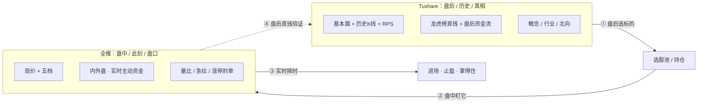

# astock-agent · 实时盯盘系统 复盘梳理

> 生成时间：2026-06-27 22:01 ｜ 对应 commit：`7c3bf06` ｜ 作者：CodingYOLO + Claude

---

## 一、这次做了什么（一句话）

基于新购的 **幕数据「沪深全推 L1 实时行情」（TCP 长连接，¥1800/年）**，给项目装上了一套**全市场实时盯盘系统**：
**数据底座 → 实时分析信号 → 网站看板 → Bark 手机推送**，全链路打通。

盯盘重心是 **全市场「板块 → 龙头 → 资金」**（不局限自选），机会侧与风险侧信号成体系。

---

## 二、数据源架构（核心认知：互补，不替代）

全推**只换"盘中实时报价"这一层**，Tushare 一个都不动。原因：全推是"实时 L1 tick 流"，只有当下，没有历史、基本面、真机构钱。

| 数据需求 | 数据源 | 角色 |
|---|---|---|
| 盘中实时报价 / 五档 / 内外盘 / 量比 | **全推** | 实时层（盘中此刻、盘口、主动买卖资金） |
| 历史日线/复权/指数/筹码/每日指标 | Tushare | 结构层（历史） |
| 盘后资金流（超大单/大单）/ **龙虎榜真钱** / 北向 | Tushare | 资金层（盘后、真机构钱） |
| 概念/行业成分 / 财务 / 业绩预告 | Tushare / 同花顺 | 基本面与映射 |
| 千股千评 / 财联社 / 新闻 | akshare | 情绪舆情 |
| 实时报价兜底 | 新浪 | 全推断流时自动回退 |

### 三种"资金"的诚实区分（铁律）
1. **实时内外盘**（全推 · **估算**）——"此刻谁正被主动买/砸"，最早。
2. **盘后超大单/大单**（Tushare · 按单分类）——更细，盘后才有。
3. **龙虎榜机构席位**（Tushare · **真·机构钱**）——唯一"真钱"。

> 全推只补第 1 种，**绝不冒充第 2、3 种**。每个数字标注来源，三级对上才是真主力。

---

## 三、全推接入（技术要点）

- **协议**：原生 TCP 长连接；每条报文 = 4 字节小端长度前缀 + UTF-8 正文；`$` 分隔 **36 字段**（代码/名/时间戳/开高低/最新价/量额/卖五档价量/买五档价量/换手/昨收/涨跌停价/量比/内盘/外盘）。
- **连接**：连上即发 token；单连接（**web 进程独占**）；**仅交易时间开放**，休市连不上正常；断线**指数退避重连**（开盘自动接上）。
- **Phase 0 数据底座**（`app/data/fullpush/`）：
  - `parser.py`：报文 → 归一化行情（纯函数·零网络），列与 `get_realtime_quote` 对齐。
  - `snapshot.py`：线程安全全市场最新值快照（`is_stale` 兜底判断）。
  - `client.py`：TCP 收流 → 解析 → 写快照（后台线程）。

---

## 四、实时分析信号体系（机会 + 风险，成体系）

全部建为**纯函数**（`app/strategy/realtime_fund.py`，可单测），由 `realtime_hub` 聚合、`realtime_scan` 推送。

### 机会侧
| 信号 | 判定要点 | 价值 |
|---|---|---|
| 🏆 **板块龙头榜** | 板块按主动净买排序，龙头=板块内吸金最多 | 钱往哪走、谁是真龙头 |
| 🔥 **题材发酵** | Tushare 概念成分 × 全推：同题材≥3 只涨≥5% | 轮动起点 |
| 💰 **板块资金涌入** | 板块主动净买 ≥3 亿 + 均涨 | 资金做的方向 |
| 💰 **个股资金抢筹** | 外盘高 + 放量 + 上涨 + 净买达标（标注板块） | 龙头领涨苗头 |
| ⚡ **急拉** | 5 分钟涨速达标 | 抓刚启动 |
| 🚀 **尾盘拉升** | 相对 14:30 涨≥2% + 主动买 | 主力抢明天 |

### 风险侧
| 信号 | 判定要点 | 价值 |
|---|---|---|
| 💥 **龙头炸板** | 封单萎缩>60%→开板预警；脱离涨停→炸板 | 板块退潮第一信号 |
| 📉 **资金撤离板块** | 板块主动净卖 ≤-3 亿 + 均跌 | 主力在撤、退潮 |
| 💥 **个股闪崩** | 3 分钟跌速 ≤-6% + 放量 + **内盘主动砸** | 区分"被砸"vs"急跌有人接" |
| 🚨 **持仓闪崩** | 持仓命中闪崩 → 最高优先级 + 走「拿得住」 | 保护你的票 |
| 📉 **尾盘跳水** | 相对 14:30 跌≥2% + 主动卖 | 主力出货 |

### 中性 / 综合
- 🌡️ 大盘温度（涨跌家数/涨停跌停）
- 💼 持仓实时体检（健康/留意/风险）
- 🕒 尾盘小结（14:55 推一次：资金流入板块 + 拉升/跳水 → 定明天）

---

## 五、两个输出面（不要数据冲击）

- **🌐 网站看板 `/realtime`**：你主动看的主战场，秒级（4s）刷新。顺序：大盘温度 → 🏆板块龙头 → 🔥题材发酵 → 🕒尾盘异动 → 💰资金榜/⚡急拉 → 📉资金撤离/💥闪崩 → 💼持仓体检。
- **🔔 Bark 手机推送**：只推"该打断你的"，**当天去重不刷屏**，仅交易时段 + 全推在线时推。原始数据洪流只进服务器，永不进手机。

> 防双推：全推盯盘扫描只做**全推独有信号**（资金口径），与现有新浪 cron（涨幅口径的弱转强/涨停潮/集合竞价）不重叠。

---

## 六、测试与质量

- 纯函数全单测：`tests/test_fullpush_parser.py`（9 项，官方样本固化 36 字段映射）+ `tests/test_realtime_fund.py`（**15 项**，覆盖资金/板块龙头/题材/炸板/尾盘/闪崩）。
- 自定义 runner（`.venv/bin/python tests/test_xxx.py`，无 pytest）。
- 端到端：用幕数据测试端点（回放真实 A 股）验证连接/解析/看板/Bark 全链路。

---

## 七、待办与下一步

1. **周一开盘"验全推"**（最重要）：连生产端实测延迟/完整性，看板自动填充。
2. **按真盘校准阈值**：闪崩/急拉/题材/板块涌入等阈值（在 `realtime_fund.py` / `realtime_scan.py` 常量），真盘跑一天再定。
3. **下一批信号候选**：🎯 打板预判、连板高度榜、龙头涨停后板块补涨。
4. 建议：信号已成体系，**先验真盘、校准阈值，比继续堆信号更有价值**。

---

## 八、口径与纪律（写给未来的自己）

- 内外盘是 **L1 估算**，永远标注"非龙虎榜真钱"。
- 不臆想数字，每个数据带来源；预告类按时效过滤。
- 全推单连接 + web 单 worker，勿加 worker。
- 新浪退为兜底；Tushare 结构层不动。
