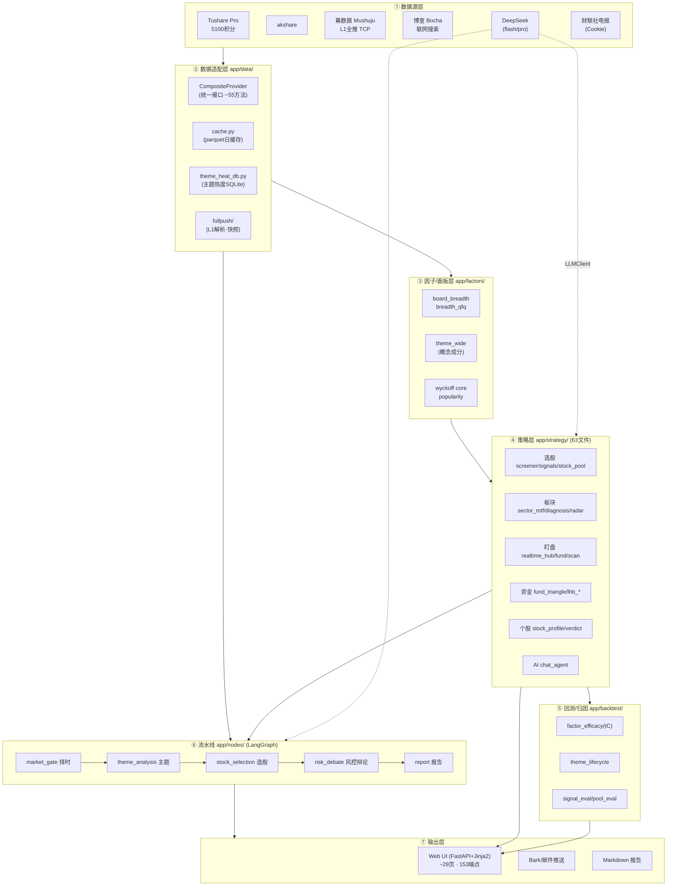
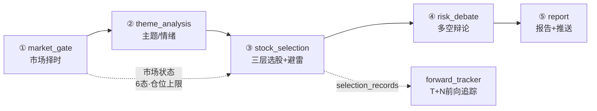
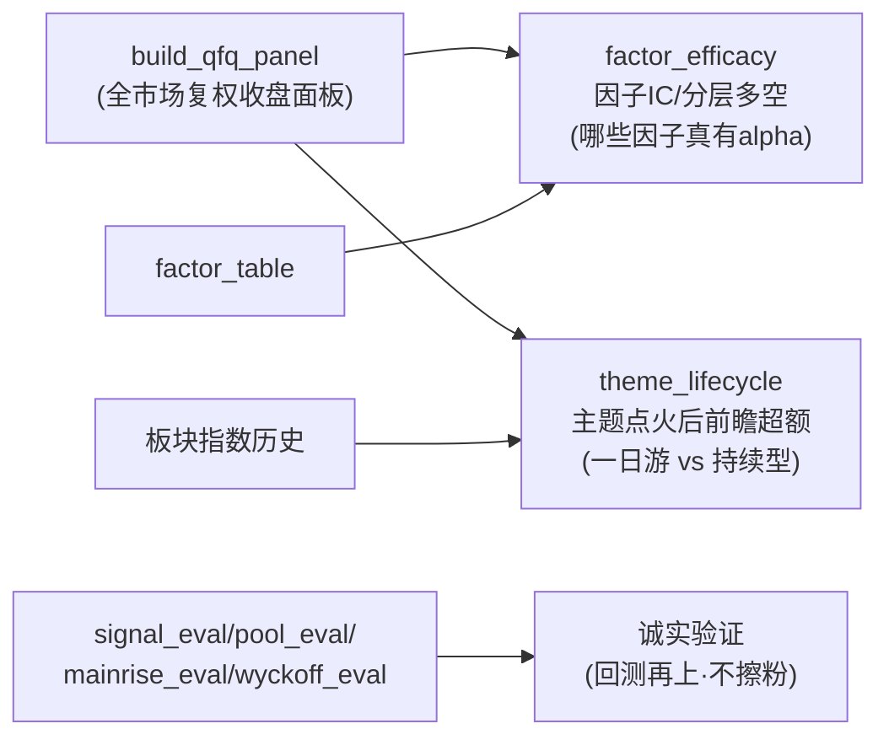

# astock-agent · 项目全景与架构

> 生成于 2026-07-06 · 与 [复现与运维手册](复现与运维手册_20260706_1615.md) 配套阅读。
> 本文回答"这是什么、怎么组织、数据从哪来到哪去"；复现手册回答"怎么从零跑起来"。

---

## 一、一句话定位

**面向科技股波段/短线的 A 股多 Agent 量化研判系统**：盘后跑数据流水线（择时→主题→选股→风控→报告），盘中用 L1 全推做实时盯盘，全程可视化成 ~29 个网页 + AI 投研对话 + Bark 推送。核心纪律：**数据带来源可核查、不臆想、不输出胜率排序、不做方向性买卖建议**。

---

## 二、总体架构（分层）



**分层原则（架构纪律·见 CLAUDE.md）**：
- 所有数据访问走 `CompositeProvider`，上层禁止直接 import akshare/tushare。
- 所有 LLM 调用走 `LLMClient`，禁止直接 openai SDK。
- 配置全走 pydantic-settings + `.env`，禁硬编码 key/token。
- 每个 LangGraph 节点只做一件事，读写 PipelineState。

---

## 三、数据源全景（口径 · 真钱 vs 估算）

| 数据源 | 提供什么 | 关键口径 / 诚实标注 |
|---|---|---|
| **Tushare Pro**(5100积分) | 全市场日线/复权/指数/每日指标、个股资金流`moneyflow`、龙虎榜`top_list`/`lhb_inst`、北向、财务`fina_indicator`、筹码`cyq_perf`、业绩预告/快报、**限售解禁`share_float`**、申万行业分类、同花顺概念`ths_index`/`ths_member`、概念资金`moneyflow_cnt_ths`、技术因子`stk_factor` | 生产主数据源。**行业=申万二级**(131个)；概念=同花顺(不同口径只同列比)。**龙虎榜机构席位净买=唯一真机构钱**；`moneyflow`聚合的"主力净流入"=**估算(超大单+大单)·非真钱** |
| **akshare** | 全市场实时快照`spot_em`(盘中兜底)、千股千评、财联社电报、研报、分析师、个股新闻(本环境pyarrow报错→已改博查) | 盘中/情绪辅助。间隔≥1.5s·失败重试 |
| **幕数据 Mushuju L1全推** | **盘中秒级 TCP 推送**：36字段(开高低收/量额/五档买卖/换手/量比/内外盘/涨跌停价) | 盯盘主数据源。断流>15s→Sina兜底。生产`qt2.chagubang.com` |
| **博查 Bocha** | 联网搜索(隔夜要闻/复盘/研报观点/个股舆情避雷) | **只作上下文·带媒体+日期来源**·结构化事实(解禁/减持)不从网页断言(见ai-data纪律) |
| **DeepSeek** | flash(deepseek-chat·高频打分/抽取)、pro(deepseek-reasoner·综合报告/辩论) | 走`LLMClient`·分层控本(`app.run cost`打印token) |
| **财联社** | 电报快讯(+Cookie) | 盘前/盘后新闻 |

**A股配色铁律**：红涨 `#f6465d` / 绿跌 `#2ebd85`。

---

## 四、时间轴：一天里系统在做什么（cron 调度）

```
时段          任务(cron·工作日)                     产出
─────────────────────────────────────────────────────────
08:35   pool-check(选股池盘前体检)           减持/解禁/预告→利好利空
09:00   pre(盘前快讯)                        隔夜要闻+开盘预判
09:05   restore_production_feed.sh           恢复幕数据L1生产feed
09:00~15:00                                  ┌ 盯盘实时循环 ┐
  每1分钟  watch-scan(自选盯盘)              │ 自选异动→Bark │
  每3分钟  market-scan(市场扫描)             │ 急拉/闪崩/发酵 │
                                             └ Web /realtime │
12:00   mid(午间快讯)                        上午盘面+午后策略
16:15   post-quick(盘后快讯)                 实盘数据复盘(收盘后快出)
18:00   wide(板块广度预算) / news-digest预告  广度缓存 / 下周前瞻
18:08   theme-llm(行业) 18:12(概念)          主线LLM研判
18:30   run(完整流水线 LangGraph 5节点)      择时→主题→选股→风控→报告
18:35   post-quick --full                    完整盘后报告
18:45   stock-pool(选股池)                   每日精选池+前向追踪
19:00   bull-catalysts 19:10 research-hub    催化剂/研报中心
19:25   warmup(暖机·预算所有缓存)            因子表/诊断/大周期榜/资金时序/主题生命周期…
20:18   activity-rank(活跃度轨迹)            人气反转数据
每天    09:30 news-digest(消息面) 18:00(前瞻)
```

**关键**：`warmup`(19:25) 把重计算(因子表 v24/大周期榜/资金时序/主题生命周期/板块广度/AI研判)全部预算成缓存，让白天网页**点开秒显示**。因子归因(factor_efficacy·重)仅**周一**重建。

---

## 五、核心流水线：LangGraph 5 节点（`app.run run`·18:30）



- **① market_gate**：涨停≥80+跌停<15+MA5占比>55%→强势(仓0.6)；下跌>3000或跌停>30→弱势(不开仓)；其余→震荡。6态：衰退/弱势/退潮反抽/震荡/升温/主升。涨跌停统计板块感知(主板10%/科创创业20%/北交所30%/主板ST 7-6起10%)。
- **② theme_analysis**：主题热度(theme_heat_db)+情绪+概念映射。
- **③ stock_selection**：吴川三层(市值200-5000亿/趋势/量价/资金/强弱 RPS≥70)+结构化避雷(减持/立案+博查负面)。
- **④ risk_debate**：LLM 多空辩论(pro)。
- **⑤ report**：Markdown 报告 + Bark/邮件；重点票落 `selection_records`→前向追踪 T+1/3/5 收益。

---

## 六、策略层地图（`app/strategy/` 63 文件·按功能分组）

| 功能域 | 关键文件 | 说明 |
|---|---|---|
| **选股/因子** | `screener`(因子表v24·~55因子) `signals` `stock_pool`(池评分) `saved_strategies` `resonance` `hot_reversal` `key_levels` | 因子筛选+池精选+预设 |
| **板块/行业/概念** | `sector_mtf`(月线定向大周期榜) `sector_diagnosis` `sector_radar`(广度) `sector_scope` `sector_strength` `sector_attribution` `industry_flow`(资金) `industry_insight` `concept_flow` `concept_detail` `sw_membership` `tech_chain` `style_radar` | 板块诊断/资金/月周线 |
| **盯盘/实时** | `realtime_hub`(看板枢纽) `realtime_fund`(纯函数:竞价/作战台/开盘强势榜) `realtime_scan`(30s扫描Bark) `market_hub` `market_radar` `market_alert` `market_sentiment` `signal_watch` `watch_alert` `activity_rank` | L1全推盯盘 |
| **资金/龙虎榜** | `fund_triangle`(资金三角) `lhb_inst`(机构真钱) `lhb_review` `lhb_seats` | 真钱vs估算 |
| **个股画像/研判** | `stock_profile`(K线+多周期) `stock_verdict` `company_profile` `fundamentals` `hold_decision` `trade_plan` | 个股360 |
| **主线/主题/AI** | `mainline_analysis` `theme_llm` `bull_hunter` `chat_agent`(投研对话) `chat_inflight` | LLM研判 |
| **情绪/训练** | `perception_trainer` `tplus_trainer` `cognition` `analysts` | 认知/复盘 |
| **盘前/风险/持仓** | `pool_premarket`(体检·**解禁走share_float结构化**) `news_guard` `reg_risk` `portfolio` | 消息面避雷 |
| **基础工具** | `db`(SQLite:stock_pool/selection_records/performance_records) `trade_calendar` `forward_tracker`(前向追踪) `detail_common` | 持久化 |

---

## 七、回测/归因层（`app/backtest/`）



- **factor_efficacy**：标准横截面因子检验(Rank-IC + IC_IR + 分层多空价差·天然市场中性)。**诚实发现**：稳健正alpha=千评/ROE/资金持续；动量类🟡弱/看regime；游资接力🔴稳健负。|IC|仅0.02-0.07。
- **theme_lifecycle**：板块指数几年回测·点火日→T+1/5/10/20累计超额→一日游/持续型标签。
- **诚实纪律**：新因子/信号**先回测再上**，IC≈0 就不加(如 HH/HL 结构因子实测 IC≈0→未加)。

---

## 八、Web 页面清单（~29 页·`/` 路由）

| 分组 | 页面 |
|---|---|
| **选股/回测** | `/screener`因子选股 `/backtest`回测 `/strategy`策略库 `/tracking`前向追踪 `/stockpool`选股池 |
| **板块/主题** | `/diagnosis`板块诊断(大周期榜+主题生命周期) `/sectorscope`板块全景 `/concept`概念 `/industry`行业 `/insight`行业洞察 `/chain`产业链 `/market`市场 `/overview`总览 |
| **盯盘/实时** | `/realtime`实时盯盘(⚔️作战台+🔥全市场强势榜+竞速榜) `/sentiment`情绪 `/perception`盘感训练 `/tplus`T+0训练 |
| **个股/持仓** | `/stock`个股360 `/hold`持仓 `/portfolio`组合 `/plan`交易计划 |
| **资金/龙虎榜** | `/lhb`龙虎榜机构 |
| **AI/研报** | `/chat`AI投研对话 `/llm`主题 `/research`研报中心 `/analysts`分析师 `/bull`妖股 `/cognition`认知 |

盯盘页数据链路：`幕数据L1 TCP → fullpush解析 → 内存快照 → build_board(1.5s缓存) → /api/realtime/board → 前端2s轮询`。

---

## 九、缓存与持久化

- **parquet 日缓存**(`cache.py cached_daily`·只存DataFrame·查`.empty`)：`data_cache/factor_table/{date}_v24.parquet`、`board_breadth/{date}.json`、`sector_mtf/`、`factor_efficacy/`…
- **JSON 日缓存**(dict结果:榜/AI研判/资金时序)。
- **SQLite**：`strategy.db`(stock_pool/selection_records/performance_records)、`theme_heat.db`(主题热度时序)、`history.db`、`llm_cost.db`、`backtest_history.db`。
- **版本纪律**：改因子计算必 bump `_FACTOR_TABLE_VERSION`(当前v24)否则读到旧坏缓存。

---

## 十、当前状态速览（截至 2026-07-06）

- ✅ 因子选股(v24·质量资金共振预设·IC成色标注) / 板块大周期榜+主题生命周期 / 竞价·开盘作战台+全市场强势榜 / AI投研对话(复制文字/长图) / 前向追踪回环已修
- ⏳ 待办：吴川归因套件#1统计规律/#4轮动 · 策略胜率归因(攒够选股史) · 竞价阈值真盘校准
- 🚫 未做(诚实决定)：HH/HL结构因子(IC≈0·不加)
