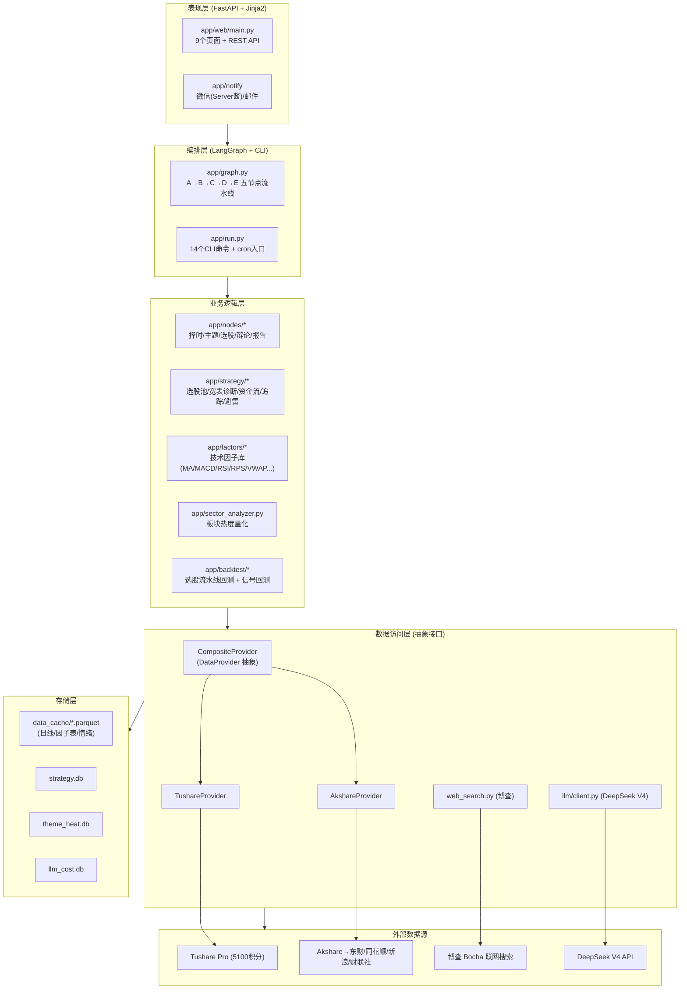
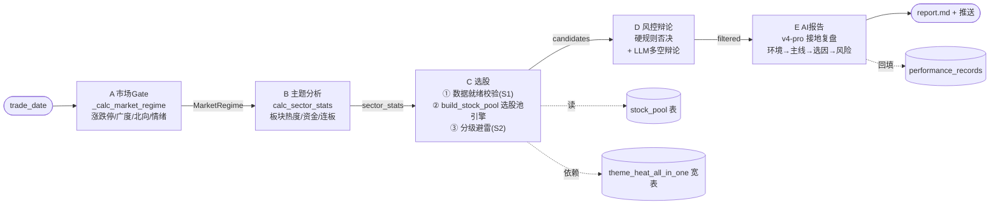
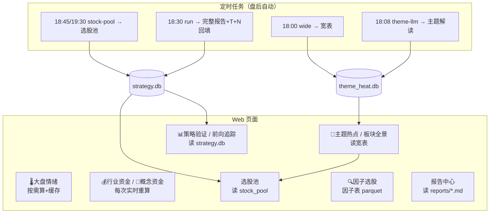
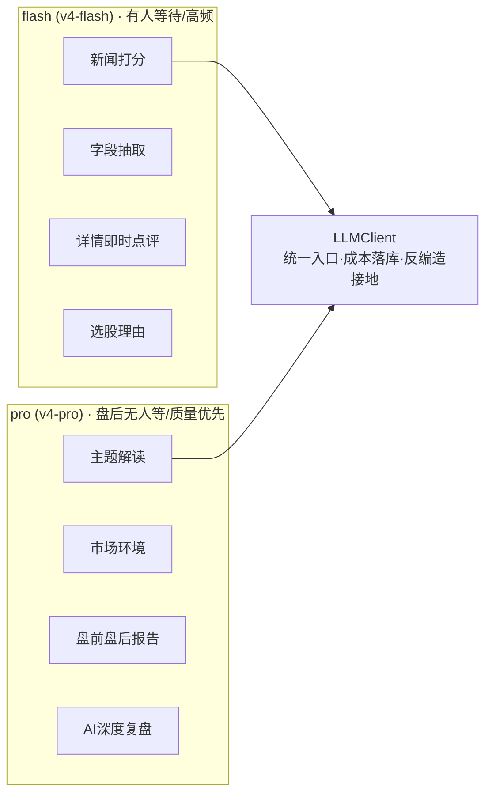
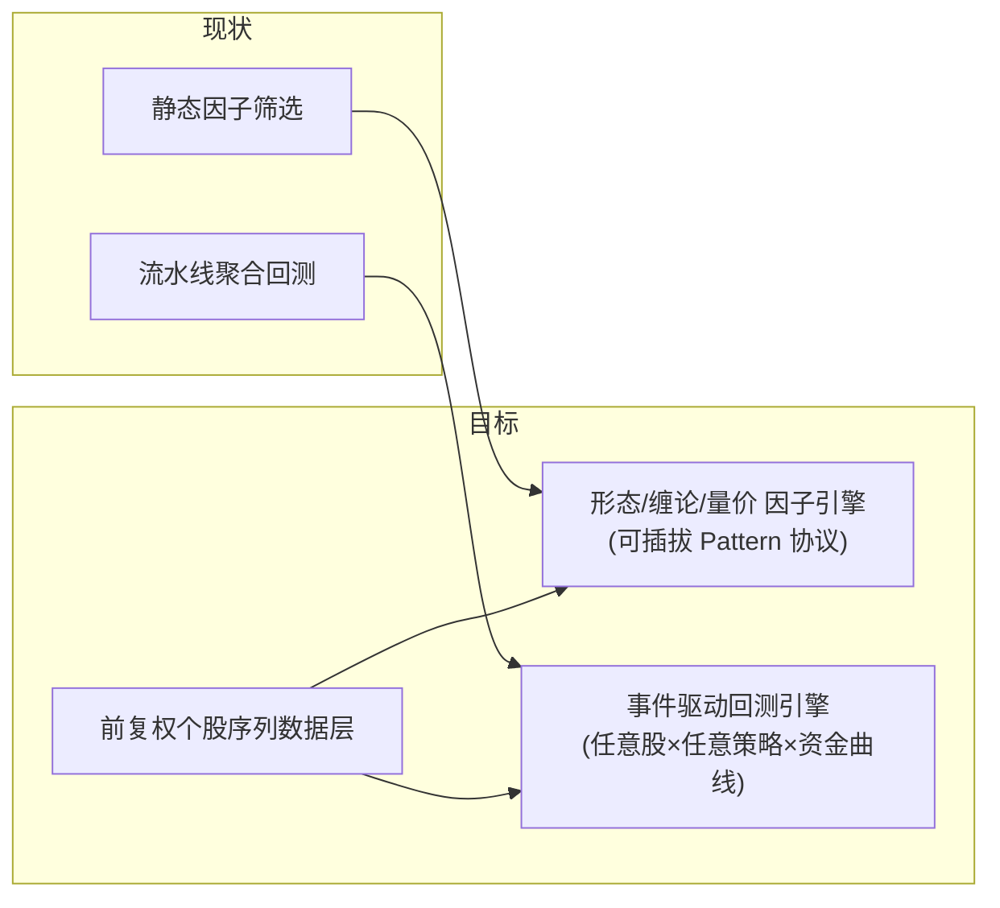

# A股量化 Agent · 项目架构全景文档

> 生成时间：2026-06-17 14:05　|　对应代码：main 分支（commit e9e1b29 之后）
> 本文档用「文字 + Mermaid 图 + ASCII」全面拆解项目的**架构 / 数据源 / 数据流 / 存储 / 部署**，
> 并给出**现状评估与改进方向**。具体优化怎么做，见配套文档
> 《优化路线图_因子选股与回测引擎_20260617_140534.md》。

---

## 一、项目定位

一个**A股盘前/盘中/盘后全流程的量化 + LLM 投研 Agent**，对标吴川体系三层选股，核心能力：

| 能力域 | 现状 |
|---|---|
| 市场择时 | ✅ 涨跌停/广度/北向/情绪多指标定调 |
| 主题/板块分析 | ✅ 宽表中枢 + 三视角诊断 + LLM 解读 |
| 选股 | ✅ 选股池(5策略) + 完整报告(吴川三层融合) + 因子选股器 |
| 风控 | ✅ 分级避雷 + 多空辩论(LLM) |
| 报告/推送 | ✅ 盘前/盘中/盘后/选股，Web + 微信 + 邮件，长图/PDF 导出 |
| 前向追踪 | ✅ T+1/3/5 自动回填 |
| **回测** | ⚠️ 仅「选股流水线聚合胜率」，**无单股×多策略的资金曲线回测** |
| **因子选股** | ⚠️ 仅静态因子布尔筛选，**无K线形态/缠论/量价形态** |

> 后两项是本文重点指出的短板，配套文档给出落地方案。

---

## 二、分层架构（总览）



**依赖方向严格单向向下**：上层只依赖下层的抽象接口。三条铁律（见 `CLAUDE.md`）：
1. 所有数据访问走 `CompositeProvider`（`DataProvider` 抽象），禁止上层直接调 akshare/tushare。
2. 所有 LLM 调用走 `LLMClient`，禁止直接调 openai SDK。
3. 配置走 pydantic-settings + `.env`，禁止硬编码 key/token。

---

## 三、目录结构与模块职责

```
app/
├── config.py              # pydantic-settings 配置（.env），NO_PROXY 注入
├── state.py               # PipelineState/Candidate/SectorStat 等 pydantic 数据模型
├── graph.py               # LangGraph 五节点编排
├── run.py                 # CLI 入口（14 命令 + cron）
│
├── data/                  # ── 数据访问层 ──
│   ├── provider.py            # DataProvider 抽象基类（22个接口）
│   ├── composite_provider.py  # 组合 Tushare+Akshare，统一出口
│   ├── tushare_provider.py    # 行情/资金/龙虎榜/北向/复权因子
│   ├── akshare_provider.py    # 板块/概念/千评/财联社/实时快照
│   ├── history_loader.py      # 全市场价格矩阵加载（pivot）
│   ├── cache.py               # parquet 按日缓存
│   ├── theme_heat_db.py       # theme_heat.db 存储层
│   ├── web_search.py          # 博查联网搜索
│   └── verify.py              # 接口健康校验
│
├── factors/               # ── 技术因子库（纯函数，可单测）──
│   ├── core.py               # MA/MACD/RSI/量比/RPS/VWAP/回踩评分/止损止盈
│   ├── breadth_qfq.py        # 前复权8档均线广度
│   ├── popularity.py         # 换手率人气代理
│   └── theme_wide.py         # 主题宽表中枢计算
│
├── nodes/                 # ── LangGraph 五节点（每节点只做一件事）──
│   ├── a_market_gate.py      # A: 市场择时
│   ├── b_theme_analysis.py   # B: 主题/板块分析
│   ├── c_stock_selection.py  # C: 选股（已融合选股池引擎）
│   ├── d_risk_debate.py      # D: 风控 + 多空辩论
│   ├── e_report.py           # E: AI 深度复盘报告
│   ├── quick_report.py       # 盘前/盘中/盘后快讯（LLM 提示词在此）
│   └── post_market.py        # 盘后速报（非LLM，确定性）
│
├── strategy/              # ── 业务策略层 ──
│   ├── stock_pool.py         # 选股池引擎（5策略+多路置信度+风控）
│   ├── signals.py            # 信号库
│   ├── sector_scope.py       # 板块全景三视角诊断
│   ├── screener.py           # 因子选股器（因子表+布尔筛选）
│   ├── market_sentiment.py   # 大盘情绪仪表盘
│   ├── industry_flow.py      # 行业资金流
│   ├── concept_flow.py       # 概念资金流（同花顺口径）
│   ├── forward_tracker.py    # T+1/3/5 前向追踪回填
│   ├── news_guard.py         # 博查负面新闻避雷
│   ├── market_extras.py      # 业绩预告/减持等结构化避雷
│   ├── theme_llm.py          # 主题 LLM 解读落库
│   ├── analyzer.py           # 策略验证（因子分桶胜率分析）
│   └── db.py                 # strategy.db 存储层
│
├── backtest/              # ── 回测 ──
│   ├── engine.py             # 选股流水线回测（T+1/3/5 胜率）
│   └── signal_eval.py        # 龙虎榜/炸板率信号回测
│
├── llm/client.py          # DeepSeek V4 统一客户端（flash/pro 分层）
├── notify/                # 微信/邮件推送 + Markdown→HTML
└── web/                   # FastAPI + Jinja2 模板（9页面）
```

---

## 四、数据源全景

### 4.1 数据源路由（CompositeProvider）

| 数据 | 数据源 | 接口 | 积分/说明 |
|---|---|---|---|
| 全市场日线（**不复权**） | Tushare | `daily` | 120 |
| 复权因子 | Tushare | `adj_factor` | —（仅均线广度用前复权） |
| 股票基础/列表 | Tushare | `stock_basic` | 120 |
| 交易日历 | Tushare | `trade_cal` | 120 |
| 指数日线 | Tushare | `index_daily` | 120 |
| 每日指标(市值/换手/PE/PB) | Tushare | `daily_basic` | — |
| 个股资金流 | Tushare | `moneyflow` | 2000 |
| 龙虎榜 | Tushare | `top_list` | 2000 |
| 北向资金 | Tushare | `moneyflow_hsgt` | 2000 |
| 同花顺概念列表/成分/资金 | Tushare | `ths_index/ths_member/moneyflow_cnt_ths` | 5000 |
| 行业/概念列表·成分·资金排名 | Akshare→东财 | `stock_board_*_em` | 免费 |
| 全市场实时快照 | Akshare→东财 | `stock_zh_a_spot_em` | 免费 |
| 实时报价(盘中盯盘) | 新浪 | `hq.sinajs.cn` | 免费 |
| 千股千评 | Akshare→东财 | `stock_comment_em` | 免费 |
| 财联社电报 | Akshare→财联社 | `stock_info_global_cls`(+Cookie) | 免费 |
| 个股新闻 | Akshare→东财 | `stock_news_em` | 免费 |
| 真实最新新闻(反编造) | 博查 Bocha | `api.bochaai.com` | 付费Key |
| LLM 推理/解读 | DeepSeek | V4-pro / V4-flash | 付费 |

### 4.2 关键数据口径（务必牢记）

```
行情/资金     → Tushare 不复权（与选股线、个股信号一致）
均线广度       → 前复权（adj_factor，避免除权污染）   ← 唯一用前复权处
行业板块       → 东财(EM)口径
概念板块       → 同花顺(ths/Tushare)口径   ← 与吴川东财口径不同（板块名/成分不一致）
板块资金(行业)  → 主力=超大单+大单口径（非 net_mf_amount）
人气           → 换手率排名代理（替代不稳定的东财人气榜）
```

---

## 五、数据流

### 5.1 选股线（LangGraph 五节点，盘后 18:30 `run`）



**数据泄漏防护**：选股只用 `run_date` 及之前的数据；买入用 T+1 开盘价，卖出用 T+N 收盘价。

### 5.2 Web 各页面数据流（读多写少，按需算/cron预算）



---

## 六、存储层

### 6.1 三个 SQLite 库

```
data_cache/strategy.db
├── selection_records      # 选股记录（含因子快照、交易计划）
├── performance_records    # T+1/3/5 实际表现（前向追踪回填）
└── stock_pool             # 选股池（5策略候选 + 置信度 + 理由）

data_cache/theme_heat.db
├── theme_heat_all_in_one  # 主题宽表中枢（资金/广度/Top100/人气/heat）★核心
├── theme_llm              # 主题 LLM 解读落库
├── market_env             # 每日市场环境
└── popularity_rank        # 换手率人气代理

data_cache/llm_cost.db
└── (LLM 调用 token 与成本)
```

### 6.2 Parquet 缓存（按交易日）

```
data_cache/
├── {YYYYMMDD}_daily.parquet 等   # 日线/基础/资金按日缓存（同日同接口只拉一次）
├── factor_table/{date}.parquet   # 因子选股器的全市场因子表（重算~30-60s）
└── sentiment/{end}_{days}.json   # 大盘情绪结果缓存
```

**缓存纪律**：同一交易日同一接口只拉一次；akshare 调用间隔 ≥1.5s，失败指数退避重试3次。

---

## 七、LLM 分层与编排



**接地铁律**：只解释因子、引用真实新闻附来源链接、反编造、不预测涨跌、不输出胜率排序。

---

## 八、部署与定时任务

- **服务器**：腾讯云上海 2核4G，`123.207.223.176`，systemd `astock-web`（开机自启+崩溃重启）
- **同步**：`rsync`（排除 .venv/缓存/`static/*.js`）→ `systemctl restart astock-web`
- **定时任务（北京时间，工作日）**：

```
09:00 pre          盘前快讯       12:00 mid          盘中快讯
16:15 post-quick   盘后速报       18:00 wide         主题宽表
18:08 theme-llm    行业主题解读   18:12 theme-llm     概念主题解读
18:30 run          完整选股报告   18:35 post-quick --full 盘后复盘
18:45 stock-pool   选股池         19:30 stock-pool --skip-if-fresh  兜底重跑
```

---

## 九、现状评估

### 9.1 做得好的地方（架构优点）

- ✅ **清晰分层 + 依赖倒置**：`DataProvider` 抽象隔离数据源，换源/加源不影响上层。
- ✅ **节点化编排**：LangGraph 五节点单一职责，可独立测试/替换。
- ✅ **配置化 + 无硬编码**：阈值/口径集中可调（如 `sector_scope._THRESHOLDS`）。
- ✅ **数据纪律**：缓存去重、缺数据显式标注、绝不展示旧/假数据。
- ✅ **成本可控**：flash/pro 分层，成本落库可查。
- ✅ **工程完备度**：cron 自动化、健康检查、前向追踪、推送、导出。

### 9.2 主要短板（改进重点）

| # | 短板 | 影响 | 详见 |
|---|---|---|---|
| 1 | **回测=选股流水线聚合胜率**，无单股×多策略的资金曲线/最大回撤/夏普 | 无法验证「放量突破前高在某只票上3年表现如何」 | 路线图 第二部分 |
| 2 | **因子选股仅静态布尔筛选**，无K线形态/缠论/量价形态/突破 | 选股表达力弱，做不了形态选股 | 路线图 第一部分 |
| 3 | **价格全程不复权**（仅广度用前复权） | 个股长周期回测会被除权污染 → 需前复权个股序列 | 路线图 第二部分·数据 |
| 4 | **history_loader 按「日×全市场」pivot** | 单股长历史回测低效（应支持按 ts_code 拉长序列） | 路线图 第二部分·数据 |
| 5 | 选股池/诊断阈值多为经验值 | 需对样本回归校准 | 后续 Phase |
| 6 | 概念口径为同花顺，与吴川东财不一致 | 板块名对不齐（已论证，非bug） | 已记录 |

### 9.3 改进方向总览



> **具体怎么做、分几步、为什么**——见配套文档
> 《优化路线图_因子选股与回测引擎_20260617_140534.md》。

---

## 十、附：关键文件速查

| 想改… | 去这里 |
|---|---|
| 加数据源/接口 | `data/provider.py` + `composite_provider.py` + 对应 provider |
| 加技术因子 | `factors/core.py`（纯函数，配单测） |
| 改选股池策略 | `strategy/stock_pool.py` + `strategy/signals.py` |
| 改板块诊断阈值 | `strategy/sector_scope.py::_THRESHOLDS` |
| 改因子选股器 | `strategy/screener.py::FACTOR_GROUPS` |
| 改报告文案/符号 | `nodes/quick_report.py`（提示词）/ `post_market.py` / `e_report.py` |
| 改 LLM 模型/分层 | `.env` + `llm/client.py` |
| 加 Web 页面/API | `web/main.py` + `web/templates/` |
| 加定时任务 | 服务器 `crontab -e` |
```
